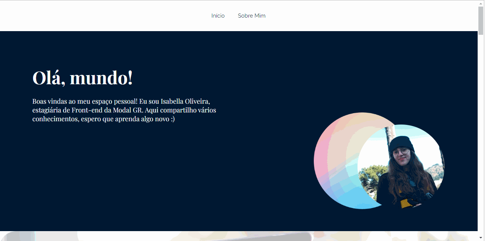

# BLOG HELLO-WORLD

O blog hello world é um blog criado em React JS, é feito utilizando React Router DOM e outras bibliotecas. Seu intuito é compartilhar artigos sobre tecnologia e informações 
relevantes sobre mim 

## Tela Inicial

Ao abrir a aplicação o usuário se depara com essa página. Onde ele pode visualizar minha foto e informações sobre mim. Logo abaixo, há
artigos sobre tecnologia, que o usuário pode clicar para visualizar. 

### WEB 

### MOBILE 

## Tela Artigo Especifico 

Ao clicar em um dos artigos, o usuario é encaminhado para ler o artigo completo. Lá ele encontrará o artigo escrito usando a linguagem 
markdown (react-markdown) que deixa as fontes e estilos de maneira decorada. E ao final da página, são recomendados outros dos artigos do
site. 

### WEB 

### MOBILE 

## Tela Sobre Mim 

O usuario acessará essa tela ao clicar em "Sobre mim" na parte superior. Aqui, podem ser visualizados um texto sobre mim e tambem uma foto 
minha

## WEB

## MOBILE

